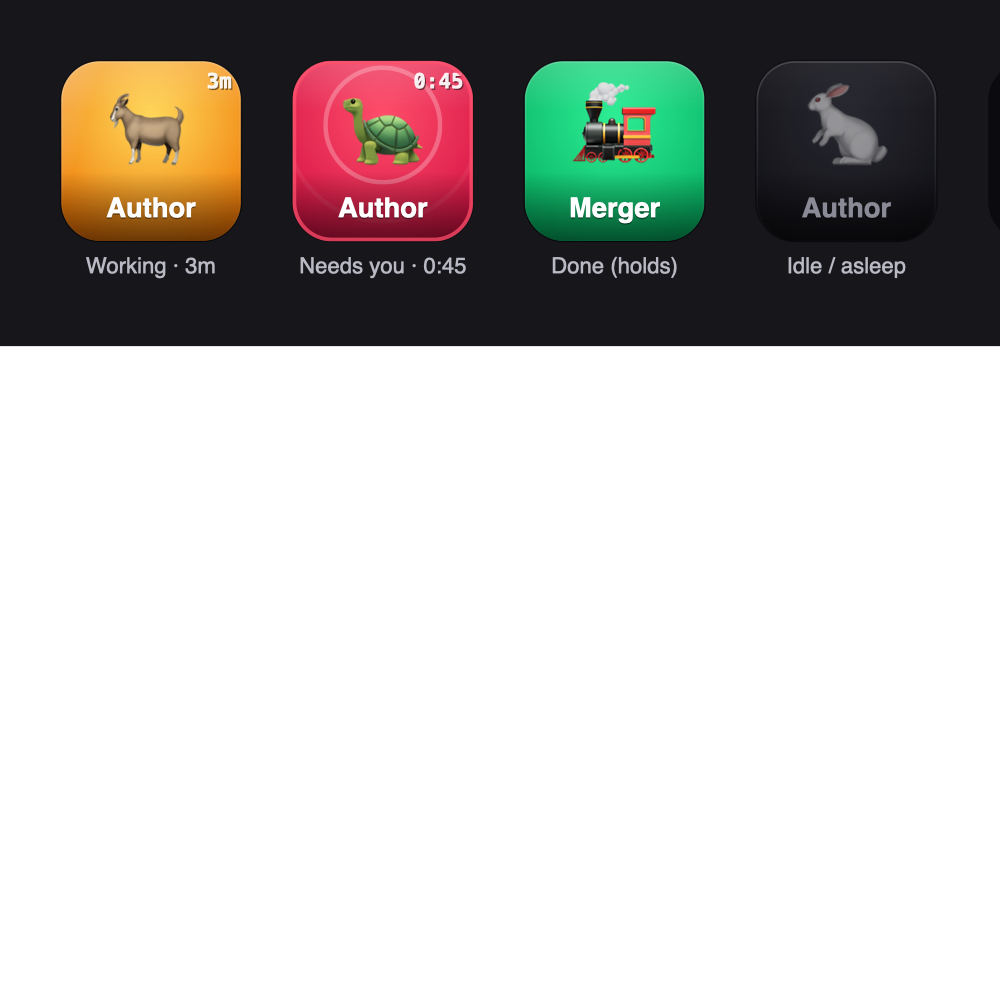

# Claude Stream Deck Dashboard 🎛️

Turn a Stream Deck into a live status board for your Claude Code agents. Every
running agent becomes a glowing key — it **breathes** while it works, **pings**
when it needs you, and holds **green** when it's done. One glance at the desk
tells you where to look.



## The signal language

| Key | Means | Motion |
|-----|-------|--------|
| 🟡 **Working** | mid-turn, using tools | breathing glow + a shimmer sweep, with an elapsed timer (`3m`) |
| 🔴 **Needs you** | blocked on your input or a permission | sonar rings + breathing rim + a white flash, with a `m:ss` timer |
| 🟢 **Done** | finished, still alive & ready | a one-shot "pop", then holds steady |
| ⚪ **Idle** | no live session behind the key | dim and still, recedes into the deck |

The whole deck also **flashes** the instant any key turns red, to catch your
peripheral vision. Press a key to bring Claude forward.

## How it works

Two halves that never call each other — loosely coupled through small files, so
nothing ever blocks:

1. **Producer** — a Claude Code **hook** (`claude/hooks/agent-status.sh`) fires on
   every lifecycle event (`PreToolUse`, `PermissionRequest`, `Stop`, …) and writes
   one tiny JSON file per session into `~/.claude/state/agent-status/`.
2. **Bridge** — the sidebar names a chat by its *conversation* id, but the hooks
   stamp files with the *transcript* id. The desktop app's own map
   (`~/Library/Application Support/Claude/claude-code-sessions/**`) stitches them.
3. **Consumer** — the Elgato plugin (`src/plugin.js`) reads those files once a
   second and repaints the keys ~15×/sec, each key an animated SVG orb.

A **sidebar group** decides which chats appear on the deck; the `/streamdeck-sync`
skill keeps the list in sync. Each key **owns** its chat, so you can drag them
into any order and it sticks.

> There's a full, animated explainer in [`docs/agent-deck.html`](docs/agent-deck.html)
> — open it in a browser.

## Install (macOS)

Requires the [Stream Deck app](https://www.elgato.com/stream-deck), Claude Code,
Node 18+, and `jq`.

```bash
git clone https://github.com/twknab/claude-streamdeck-dashboard.git
cd claude-streamdeck-dashboard
./install.sh
```

That builds + links the plugin, installs the status hook (backing up your
`settings.json`), and installs the `/streamdeck-sync` skill. Then:

1. In the Stream Deck app, drag the **Agent** action (category **Claude Agents**)
   onto a row of keys.
2. In a Claude Code chat: `/streamdeck-sync <Your Sidebar Group Name>`.
3. Restart your Claude Code sessions so the new hooks load.

## Layout

```
src/plugin.js                     the plugin: poll, per-key binding, animation engine
com.tknab.claudeagents.sdPlugin/  the Elgato plugin package (manifest, icons)
claude/hooks/agent-status.sh      the status producer (bash + jq)
claude/skills/streamdeck-sync/    the /streamdeck-sync skill
claude/agent-emojis.example.json  optional emoji overrides (auto-fill fallback)
docs/agent-deck.html              animated explainer
install.sh                        wires all of the above onto a machine
```

Edit loop: `npm run build && streamdeck restart com.tknab.claudeagents`.

## Heads up — the fragile bits

Everything that reads Claude's *internals* is reverse-engineered and undocumented,
so a Claude update could move it. It all fails **soft** (a dim key, or press just
focusing the app — never a crash):

- **The id bridge** (`claude-code-sessions/**`) — if colors stop matching after a
  Claude update, run `/streamdeck-sync`; if keys stay dim, this is why.
- **The press deep link** (`claude://code/needs-input?session=…`) — jumping to the
  *exact* chat is best-effort; focusing Claude is the reliable floor.

The hooks, the state files, the `@elgato/streamdeck` SDK, and the skill are all
first-class, supported features.

## License

MIT — see [LICENSE](LICENSE).

Built with [Claude Code](https://claude.com/claude-code).
